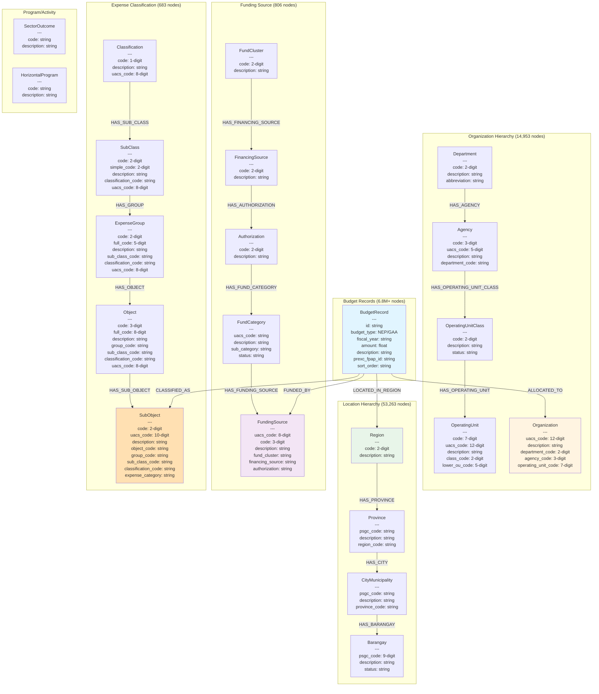

# Open Government Data - Philippine Budget Graph Database

A comprehensive data pipeline that converts Philippine government budget data (NEP/GAA) and UACS reference data into a Neo4j graph database for advanced analysis and visualization.

## 📊 Overview

This project processes 6.8+ million budget records spanning fiscal years 2020-2026, along with comprehensive reference data including organizational hierarchies, geographic locations, funding sources, and expense classifications. The data is structured as a property graph to enable complex queries and relationship analysis.

### Data Scale

- **6,858,701** total budget records (NEP + GAA 2020-2026)
- **₱106.9 trillion** total budget amount
- **70,000+** total nodes across all dimensions
- **13** budget files processed (7 NEP + 6 GAA)

## 🗂️ Project Structure

```
open-government-data/
├── data/                          # Converted JSON output files
│   ├── budget/                    # Budget records by year/type
│   │   ├── nep_2020.json - nep_2026.json
│   │   ├── gaa_2020.json - gaa_2025.json
│   │   └── _conversion_summary.json
│   ├── funding_source/            # Funding source dimension
│   ├── location/                  # Geographic dimension
│   ├── object_code/               # Expense classification
│   ├── organization/              # Government org hierarchy
│   └── pap/                       # Programs and activities
│
├── scripts/                       # Data conversion scripts
│   ├── nep-gaa/                   # Budget data converters
│   │   ├── converter.py           # Universal NEP/GAA converter
│   │   ├── converter_nep2025.py   # Legacy NEP 2025 converter
│   │   └── input/                 # Source JSON files
│   ├── nep-gaa-excel/             # Excel-based converters
│   └── uacs/                      # UACS reference converters
│       ├── funding-source/
│       ├── location/
│       ├── mfo-pap/
│       ├── object-code/
│       └── organization/
│
├── sync.py                        # Neo4j sync script
├── .env                           # Neo4j connection config
└── README.md
```

## 📈 Data Model

The graph database models Philippine government budget data as interconnected entities:



## 📋 Entity Details

### Budget Records

- **BudgetRecord**: Individual budget line items containing fiscal allocations
  - `id`: Unique identifier (sequential)
  - `budget_type`: NEP (National Expenditure Program) or GAA (General Appropriations Act)
  - `fiscal_year`: Year of the budget (2020-2026)
  - `amount`: Budget allocation amount
  - `description`: Budget item description
  - `prexc_fpap_id`: Program/Project/Activity identifier
  - `sort_order`: Ordering sequence

### Organization Entities

- **Department**: Top-level executive departments (40 entities)

  - `code`: 2-digit department code
  - `description`: Full department name
  - `abbreviation`: Short name/acronym

- **Agency**: Government agencies under departments (466 entities)

  - `code`: 3-digit agency code
  - `uacs_code`: 5-digit UACS identifier (dept + agency)
  - `description`: Full agency name
  - `department_code`: Parent department reference

- **OperatingUnitClass**: Classification of operating units (26 entities)

  - `code`: 2-digit class code
  - `description`: Class description
  - `status`: Active/Inactive status

- **OperatingUnit**: Operational units within agencies (14,461 entities)

  - `code`: 7-digit unit code
  - `uacs_code`: 12-digit full UACS code
  - `description`: Unit name
  - `class_code`: Operating unit class
  - `lower_ou_code`: 5-digit lower unit identifier

- **Organization**: Complete organizational entities (14,461 entities)
  - `uacs_code`: 12-digit unique identifier
  - `description`: Full organization name
  - `department_code`, `agency_code`, `operating_unit_code`: Hierarchy references

### Location Entities

- **Region**: Philippine administrative regions (17 entities)

  - `code`: 2-digit region code
  - `description`: Region name (e.g., "NCR", "Region I")

- **Province**: Provincial-level divisions (82 entities)

  - `psgc_code`: Philippine Standard Geographic Code
  - `description`: Province name
  - `region_code`: Parent region reference

- **CityMunicipality**: Cities and municipalities (1,634 entities)

  - `psgc_code`: PSGC identifier
  - `description`: City/municipality name
  - `province_code`: Parent province reference

- **Barangay**: Barangay-level locations (42,046 entities)
  - `psgc_code`: 9-digit PSGC code
  - `description`: Barangay name
  - `status`: Active/Inactive status

### Funding Entities

- **FundCluster**: Primary fund groupings

  - `code`: 2-digit cluster code
  - `description`: Cluster name

- **FinancingSource**: Source of financing

  - `code`: 2-digit source code
  - `description`: Source description

- **Authorization**: Budget authorization type

  - `code`: 2-digit authorization code
  - `description`: Authorization description

- **FundCategory**: Fund category classification

  - `uacs_code`: UACS identifier
  - `description`: Category description
  - `sub_category`: Sub-category classification
  - `status`: Active/Inactive

- **FundingSource**: Complete funding source (806 entities)
  - `uacs_code`: 8-digit unique identifier
  - `code`: 3-digit code
  - `description`: Full funding source name
  - `fund_cluster`, `financing_source`, `authorization`: Hierarchy references

### Expense Classification Entities

- **Classification**: Top-level expense classification

  - `code`: 1-digit class code
  - `description`: Classification name
  - `uacs_code`: 8-digit UACS code

- **SubClass**: Expense sub-classification

  - `code`: 2-digit subclass code
  - `simple_code`: Simplified code
  - `description`: Subclass name
  - `classification_code`: Parent classification

- **ExpenseGroup**: Grouped expense categories

  - `code`: 2-digit group code
  - `full_code`: 5-digit full code
  - `description`: Group description
  - `sub_class_code`, `classification_code`: Hierarchy references

- **Object**: Expense object codes

  - `code`: 3-digit object code
  - `full_code`: 8-digit full code
  - `description`: Object description
  - Hierarchy references to group, subclass, classification

- **SubObject**: Detailed expense sub-objects (683 entities)
  - `code`: 2-digit sub-object code
  - `uacs_code`: 10-digit unique identifier
  - `description`: Sub-object description
  - `expense_category`: PS (Personal Services), MOOE (Maintenance), CO (Capital Outlay)
  - Full hierarchy references

### Program/Activity Entities

- **SectorOutcome**: Government sector outcomes

  - `code`: Outcome code
  - `description`: Outcome description

- **HorizontalProgram**: Cross-cutting programs
  - `code`: Program code
  - `description`: Program description

## 🔗 Relationship Hierarchy

### Budget Record Relationships

The central `BudgetRecord` node connects to four key dimensions:

1. **ALLOCATED_TO → Organization**

   - Links budget items to organizational units
   - Enables department/agency budget analysis
   - Supports organizational hierarchy traversal

2. **LOCATED_IN_REGION → Region**

   - Geographic allocation of budget
   - Regional distribution analysis
   - Can traverse to Province → City → Barangay

3. **FUNDED_BY → FundingSource**

   - Identifies funding source for budget items
   - Traces funding hierarchy: FundCluster → FinancingSource → Authorization → FundCategory
   - Enables funding pattern analysis

4. **CLASSIFIED_AS → SubObject**
   - Expense classification and categorization
   - Links to expense hierarchy: Classification → SubClass → ExpenseGroup → Object → SubObject
   - Expense category analysis (PS/MOOE/CO)

### Organization Hierarchy

```
Department (40)
    └── HAS_AGENCY → Agency (466)
            └── HAS_OPERATING_UNIT_CLASS → OperatingUnitClass (26)
                    └── HAS_OPERATING_UNIT → OperatingUnit (14,461)
```

### Location Hierarchy

```
Region (17)
    └── HAS_PROVINCE → Province (82)
            └── HAS_CITY → CityMunicipality (1,634)
                    └── HAS_BARANGAY → Barangay (42,046)
```

### Funding Source Hierarchy

```
FundCluster
    └── HAS_FINANCING_SOURCE → FinancingSource
            └── HAS_AUTHORIZATION → Authorization
                    └── HAS_FUND_CATEGORY → FundCategory
                            └── HAS_FUNDING_SOURCE → FundingSource (806)
```

### Expense Classification Hierarchy

```
Classification
    └── HAS_SUB_CLASS → SubClass
            └── HAS_GROUP → ExpenseGroup
                    └── HAS_OBJECT → Object
                            └── HAS_SUB_OBJECT → SubObject (683)
                                    └── IN_CATEGORY → ExpenseCategory
```

## 🔑 UACS Code Structures

The Unified Accounts Code Structure (UACS) standardizes government financial data:

### Organization (12 digits)

```
Format: [DEPT(2)][AGENCY(3)][CLASS(2)][LOWER_OU(5)]
Example: 270012200001
```

- **Department**: Positions 0-1 (2 digits)
- **Agency**: Positions 2-4 (3 digits)
- **Class**: Positions 5-6 (2 digits)
- **Lower Operating Unit**: Positions 7-11 (5 digits)

### Funding Source (8 digits)

```
Format: [FC(2)][FS(1)][AUTH(2)][CAT(3)]
Example: 01101001
```

- **Fund Cluster**: 2 digits
- **Financing Source**: 1 digit
- **Authorization**: 2 digits
- **Category**: 3 digits

### Object Code (10 digits)

```
Format: [CLASS(1)][SUBCLASS(2)][GROUP(2)][OBJ(3)][SUBOBJ(2)]
Example: 5020199001
```

- **Classification**: 1 digit
- **Sub-Class**: 2 digits
- **Group**: 2 digits
- **Object**: 3 digits
- **Sub-Object**: 2 digits

### Location (PSGC Code)

```
Format: [REGION(2)][PROVINCE(2)][CITY(2)][BARANGAY(3)]
Example: 133914001 (9 digits for barangay)
```

## 🚀 Getting Started

### Prerequisites

- Python 3.8+
- Neo4j Database 5.x
- Required Python packages:
  ```bash
  pip install neo4j pandas openpyxl
  ```

### Configuration

1. **Set up Neo4j credentials** in [.env](.env):
   ```env
   NEO4J_URI=neo4j://localhost
   NEO4J_USER=neo4j
   NEO4J_PASSWORD=your_password
   ```

### Running the Pipeline

#### Step 1: Convert UACS Reference Data

Convert reference data from XLSX to JSON:

```bash
# Organization hierarchy
python scripts/uacs/organization/converter.py

# Location data
python scripts/uacs/location/converter.py

# Funding sources
python scripts/uacs/funding-source/converter.py

# Object codes (expense classification)
python scripts/uacs/object-code/converter.py

# Programs and activities
python scripts/uacs/mfo-pap/converter.py
```

#### Step 2: Convert Budget Data

Convert NEP/GAA budget records:

```bash
# Universal converter for all years
python scripts/nep-gaa/converter.py
```

The converter handles:

- NEP 2020-2026 (7 fiscal years)
- GAA 2020-2025 (6 fiscal years)
- 8-digit and 6-digit funding code formats
- Automatic UACS code validation

#### Step 3: Sync to Neo4j

Load all converted data into Neo4j:

```bash
python sync.py
```

The sync process:

1. Creates uniqueness constraints
2. Loads reference dimensions (funding, organization, location, object codes)
3. Loads budget records in batches
4. Creates relationships between nodes
5. Handles 6.8M+ records efficiently

## 📊 Data Statistics

### Budget Coverage (2020-2026)

| Fiscal Year | NEP Records | GAA Records | Total Amount |
| ----------- | ----------- | ----------- | ------------ |
| 2020        | 578,234     | 64,999      | ₱8.33T       |
| 2021        | 64,999      | 498,342     | ₱4.99T       |
| 2022        | 64,999      | 628,668     | ₱10.55T      |
| 2023        | 674,011     | 650,369     | ₱21.07T      |
| 2024        | 719,974     | 682,814     | ₱23.07T      |
| 2025        | 736,593     | 723,105     | ₱25.36T      |
| 2026        | 771,594     | -           | ₱13.59T      |

### Reference Data

| Dimension             | Count  | Description                      |
| --------------------- | ------ | -------------------------------- |
| Departments           | 40     | Top-level government departments |
| Agencies              | 466    | Government agencies              |
| Operating Units       | 14,461 | Organizational units             |
| Regions               | 17     | Philippine regions               |
| Provinces             | 82     | Philippine provinces             |
| Cities/Municipalities | 1,634  | Cities and municipalities        |
| Barangays             | 42,046 | Barangay-level locations         |
| Funding Sources       | 806    | Budget funding sources           |
| Expense Categories    | 683    | Object code classifications      |

## 🔍 Example Queries

### Query 1: Total Budget by Department (FY 2025)

```cypher
MATCH (br:BudgetRecord {fiscal_year: "2025", budget_type: "NEP"})
      -[:ALLOCATED_TO]->(org:Organization)
MATCH (dept:Department {code: org.department_code})
RETURN dept.description AS department,
       SUM(br.amount) AS total_budget
ORDER BY total_budget DESC
LIMIT 10
```

### Query 2: Regional Budget Distribution

```cypher
MATCH (br:BudgetRecord {fiscal_year: "2025"})
      -[:LOCATED_IN_REGION]->(r:Region)
RETURN r.description AS region,
       COUNT(br) AS record_count,
       SUM(br.amount) AS total_amount
ORDER BY total_amount DESC
```

### Query 3: Budget by Expense Category

```cypher
MATCH (br:BudgetRecord {fiscal_year: "2025"})
      -[:CLASSIFIED_AS]->(so:SubObject)
      -[:IN_CATEGORY]->(ec:ExpenseCategory)
RETURN ec.description AS category,
       COUNT(br) AS transactions,
       SUM(br.amount) AS total
ORDER BY total DESC
```

### Query 4: Track Funding Source Hierarchy

```cypher
MATCH path = (br:BudgetRecord)-[:FUNDED_BY]->(fs:FundingSource)
             -[:HAS_FUND_CLUSTER]->(fc:FundCluster)
WHERE br.fiscal_year = "2025"
RETURN DISTINCT fc.description AS fund_cluster,
       COUNT(br) AS budget_items,
       SUM(br.amount) AS total_amount
ORDER BY total_amount DESC
```

## 🛠️ Key Components

### [sync.py](sync.py)

Main synchronization script that loads data into Neo4j with:

- Batched node creation (5,000-10,000 per batch)
- Batched relationship creation (5,000 per batch)
- Progress tracking and error handling
- Automatic constraint creation

### Budget Converter ([scripts/nep-gaa/converter.py](scripts/nep-gaa/converter.py))

Universal converter supporting:

- All NEP/GAA formats (2020-2026)
- 8-digit native funding codes
- 6-digit funding codes with category lookup
- Field name variations (UACS_SOBJ_CD vs UACS_OBJ_CD)
- Sequential unique ID generation

### UACS Converters

Specialized converters for each dimension:

- **Organization**: Department → Agency → Operating Unit hierarchy
- **Location**: Region → Province → City → Barangay
- **Funding**: Fund Cluster → Financing Source → Authorization → Category
- **Object Code**: Classification → SubClass → Group → Object → SubObject

## 📝 Data Sources

- **Budget Data**: DBM NEP/GAA JSON exports (2020-2026) - [https://www.dbm.gov.ph/](https://www.dbm.gov.ph/)
- **UACS Reference**: DBM UACS master tables (XLSX format) - [https://uacs.gov.ph/](https://uacs.gov.ph/)
- **Location Data**: PSA PSGC (Philippine Standard Geographic Code)
- **PAP Data**: DBM MFO/PAP reference tables

## 🔐 Security Notes

- Never commit [.env](.env) file to version control
- Use strong passwords for Neo4j in production
- Restrict database access to authorized users only
- Consider encrypting data at rest for sensitive deployments

## 📄 License

This repository is dedicated to the public domain under **CC0 1.0 Universal (CC0 1.0) Public Domain Dedication**.

You can copy, modify, distribute and perform the work, even for commercial purposes, all without asking permission.

- ✅ **No Copyright**
- ✅ **No Rights Reserved**
- ✅ **No Attribution Required**

For more information, see the [CC0 1.0 Universal license](https://creativecommons.org/publicdomain/zero/1.0/).

---

This project is part of the **BetterGovPH** initiative for transparent and accessible government data.

## 🤝 Contributing

Contributions are welcome! Please ensure:

- Data converters preserve UACS code integrity
- Batch processing for large datasets
- Comprehensive error handling and logging
- Documentation for new data sources

---

**Last Updated**: October 2025
**Data Coverage**: FY 2020-2026
**Total Records**: 6.8M+ budget line items
